# InsightFlow — Business Analytics Dashboard

A modern, full-stack analytics platform for small and mid-sized businesses. Track revenue, inventory, customers, and invoices in one clean, responsive dashboard — built to look and feel like a real commercial SaaS product.


[](https://insightflow-m1go.onrender.com)

## 🌐 Live Demo

**🚀 Live Application:** https://insightflow-m1go.onrender.com

### Demo Credentials

| Username | Password |
|----------|----------|
| `admin` | `Admin123!` |

> **Note:** The application may take 30–60 seconds to wake up if it has been idle, as it is hosted on Render's free tier.

See [RELEASE_NOTES.md](RELEASE_NOTES.md) for what's new in **v1.1** (a UI/UX polish pass — no functional changes).

---

## ✨ Features

**Dashboard**
- Real-time KPI cards (revenue, orders, average order value, customers) with period-over-period trend indicators
- Interactive revenue trend chart with 7/30/90-day range toggle (updates live via API, no page reload)
- Revenue-by-category breakdown
- Top products by revenue
- Recent invoices feed
- Low-stock alerts

**Sales**
- Filterable, paginated sales list (by status: paid / pending / overdue)
- Dedicated Revenue Analytics view — monthly trend, revenue by payment method, sales rep leaderboard

**Inventory**
- Searchable, filterable product catalog
- Live stock adjustment
- Margin % per product, low-stock and out-of-stock indicators

**Customers**
- Customer directory with search, ranked by lifetime spend
- Individual customer profiles with full order history

**Invoices**
- Invoice summary with paid / pending / overdue breakdown and outstanding balance
- Individual invoice detail view
- One-click PDF invoice download

**Admin**
- User management with role assignment (Admin / Manager / Staff)
- Account activation / deactivation
- Workspace-wide stats

**Reports**
- Export sales report to PDF (ReportLab)
- Export sales report to Excel (openpyxl)

**Platform**
- Secure authentication (bcrypt password hashing, CSRF protection, session-based auth via Flask-Login)
- Role-based access control
- Dark / light mode, saved per user
- Fully responsive — desktop, tablet, and mobile (collapsible sidebar nav)
- Empty states, loading skeleton styles, and inline form validation feedback baked into the design system
- Seeded with realistic demo data (4 users, 21 products, 24 customers, 500+ historical sales) so the dashboard looks complete the moment you launch it

**Design system:** Purple brand accent throughout (green/red/amber reserved strictly for success/negative/warning status), soft layered shadows, hover-lift cards, consistent icon-led KPI cards, and subtle entrance/hover micro-interactions — see [RELEASE_NOTES.md](RELEASE_NOTES.md) for the full v1.1 polish changelog.

---

## 🛠 Tech Stack

| Layer            | Technology                                   |
|-------------------|-----------------------------------------------|
| Backend           | Flask 3, Flask-SQLAlchemy, Flask-Login, Flask-WTF |
| Database          | SQLite (dev) — swap `DATABASE_URL` for Postgres/MySQL in production |
| Frontend          | Jinja2, vanilla JS, Chart.js 4                |
| Styling           | Hand-built CSS design system (CSS custom properties, no framework lock-in) |
| Reports           | ReportLab (PDF), openpyxl (Excel)             |
| Auth              | Flask-Bcrypt (password hashing), CSRF-protected forms |

---

## 📁 Project Structure

```
insightflow/
├── app/
│   ├── blueprints/
│   │   ├── auth/          # login, register, logout, theme toggle
│   │   ├── dashboard/     # main KPI + chart overview
│   │   ├── sales/         # sales list + revenue analytics
│   │   ├── inventory/     # product catalog + stock management
│   │   ├── customers/     # customer directory + profiles
│   │   ├── invoices/      # invoice summary + detail
│   │   ├── admin/         # user & role management
│   │   ├── api/           # JSON endpoints for live chart updates
│   │   └── reports/       # PDF / Excel export
│   ├── templates/         # Jinja2 templates, organized by blueprint
│   ├── static/
│   │   ├── css/style.css  # design token system + full stylesheet
│   │   └── js/main.js     # theme toggle, sidebar, chart theming helpers
│   ├── models.py          # SQLAlchemy models
│   ├── extensions.py      # db, login_manager, bcrypt, csrf
│   └── __init__.py        # application factory
├── instance/               # SQLite DB lives here (gitignored)
├── config.py               # environment-based configuration
├── seed.py                 # demo data generator
├── run.py                  # dev / WSGI entry point
├── requirements.txt
├── Dockerfile
├── docker-compose.yml
├── .dockerignore
├── .env.example
├── .gitignore
├── RELEASE_NOTES.md
└── README.md
```

---

## 🚀 Getting Started

### 1. Clone and set up a virtual environment

```bash
python3 -m venv venv
source venv/bin/activate        # Windows: venv\Scripts\activate
pip install -r requirements.txt
```

### 2. Configure environment variables (optional for local dev)

```bash
cp .env.example .env
# edit .env — at minimum, set a real SECRET_KEY before deploying
```

### 3. Seed the database with demo data

```bash
python seed.py --reset
```

This creates `instance/insightflow.db` with 4 demo users, 21 products, 24 customers, and 500+ historical sales spanning the last 6 months.

### 4. Run the app

```bash
python run.py
```

Visit **http://127.0.0.1:5000** and log in with:

```
Username: admin
Password: Admin123!
```

(Additional demo users — `naomi.chen`, `diego.ramirez`, `alex.turner` — share the same password and demonstrate the Manager / Staff roles.)

---

## 🐳 Run with Docker

No local Python setup required — this builds the app, seeds the demo database on first boot, and serves it with gunicorn.

```bash
docker compose up --build
```

Visit **http://127.0.0.1:8000** and log in with the same demo credentials above (`admin` / `Admin123!`).

Data persists in a named Docker volume (`insightflow_data`) across restarts. To reset the demo data:

```bash
docker compose down -v      # removes the volume, wiping the database
docker compose up --build   # reseeds automatically on next boot
```

To set a real `SECRET_KEY` for the container, export it before starting:

```bash
export SECRET_KEY=$(python3 -c "import secrets; print(secrets.token_hex(32))")
docker compose up --build
```

---

## 🔐 Roles

| Role     | Access                                                        |
|----------|-----------------------------------------------------------------|
| Admin    | Full access, including the Admin Panel (user & role management) |
| Manager  | Full access to sales, inventory, customers, invoices, reports   |
| Staff    | Same as Manager (extend `admin_required`-style decorators in `auth/routes.py` to restrict further as needed) |

The **first account ever registered** automatically becomes an Admin.

---

## 📸 Screenshots

Explore InsightFlow's core modules through the screenshots below. Each section highlights a key area of the application, from authentication to business analytics and administration.

> **Note:** All screenshots are shown in the Dark theme. Every module is also fully available in Light mode via the global theme toggle, with the selected theme persisted per user.

---

### 🔐 Authentication

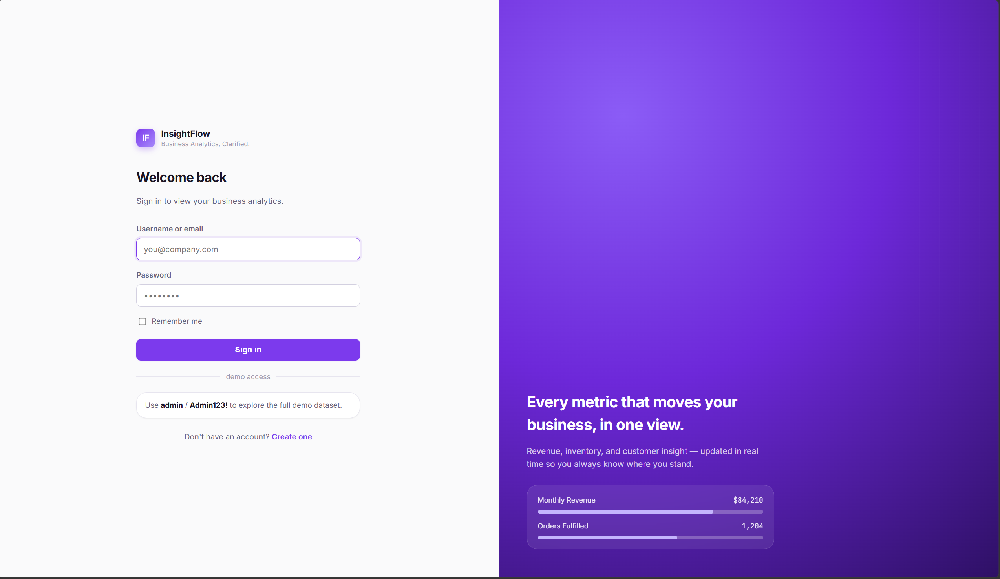

*Secure authentication with session-based login, CSRF protection, and persistent user preferences.*

---

### 📊 Dashboard

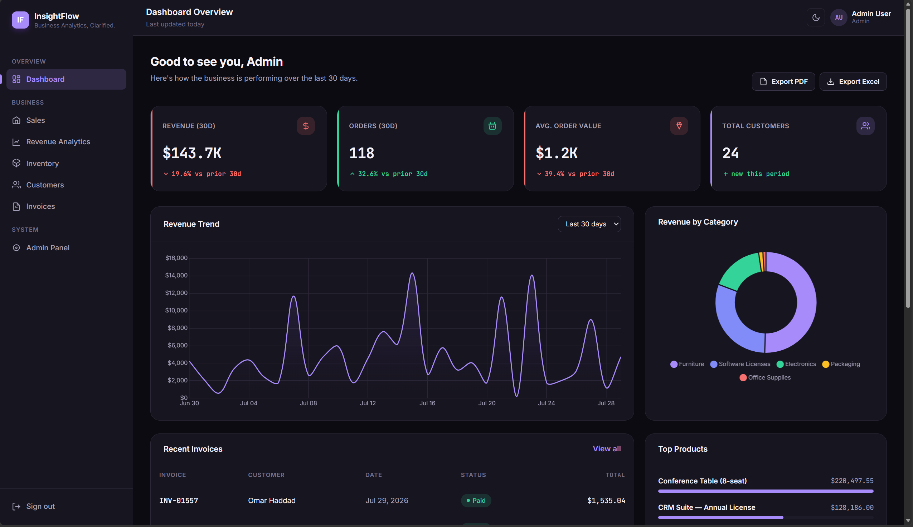

*Business overview featuring live KPI cards, revenue trends, category insights, and recent activity.*

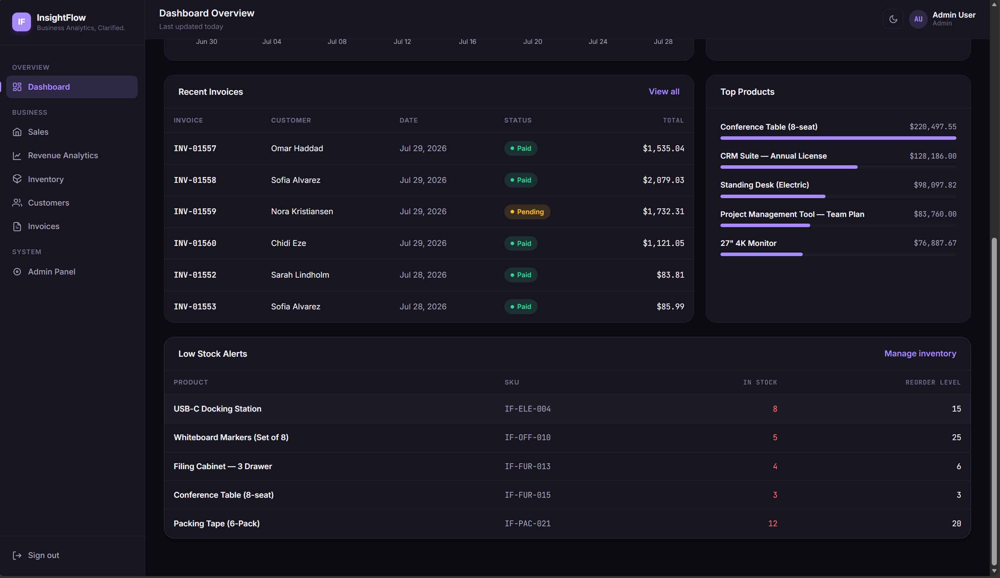

*Interactive analytics with dynamic 7/30/90-day revenue filtering, live API updates, and business insights.*

---

### 📈 Revenue Analytics

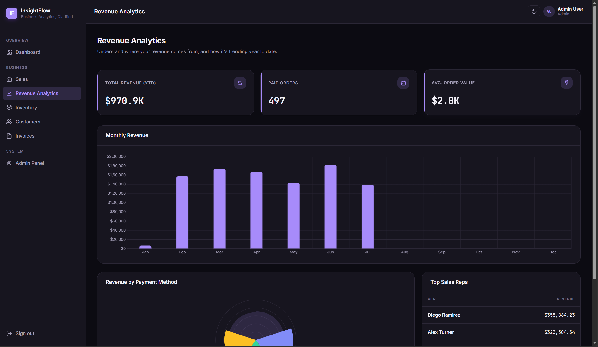

*Revenue KPIs with monthly performance insights, payment method breakdowns, and sales analytics.*

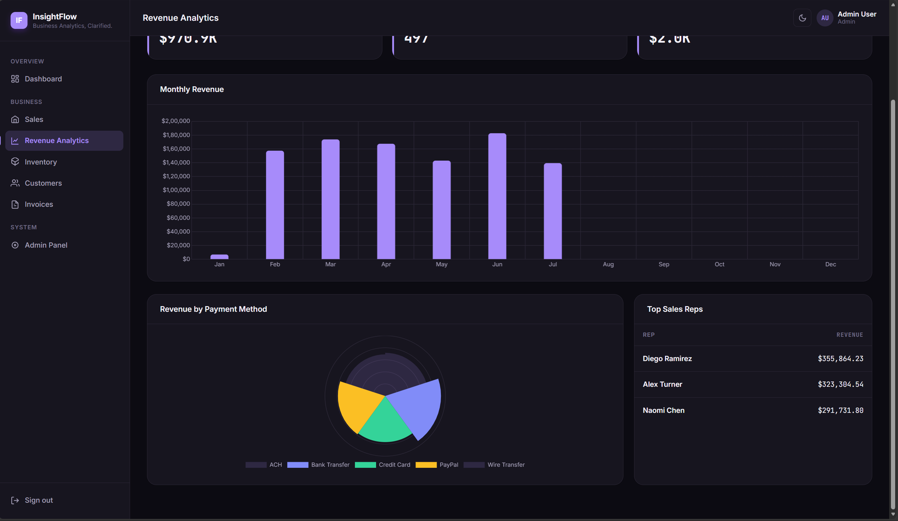

*Detailed business intelligence dashboard featuring monthly trends and sales representative leaderboards.*

---

### 📦 Inventory Management

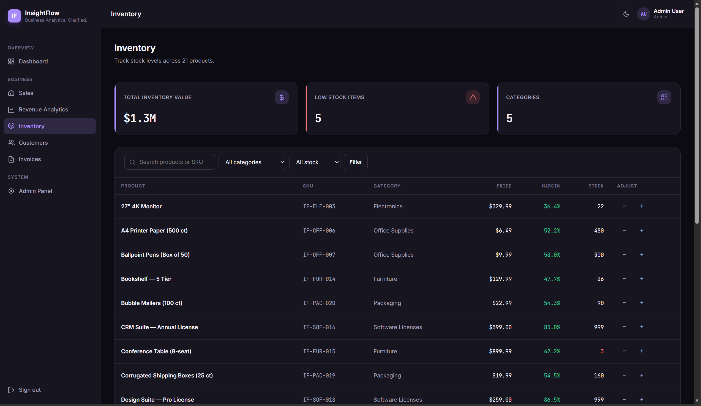

*Searchable product catalog with inventory valuation, stock indicators, and category filtering.*

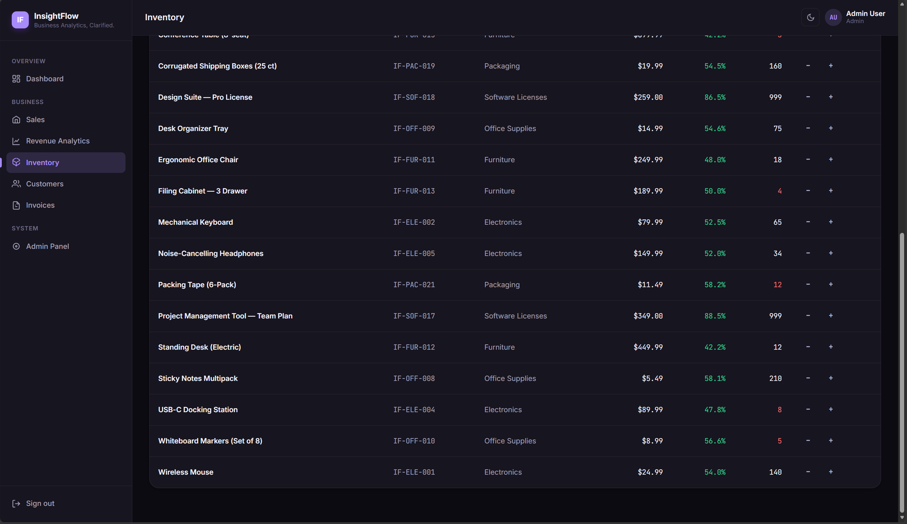

*Inline stock management with live quantity adjustments and inventory health monitoring.*

---

### 👥 Customer Management

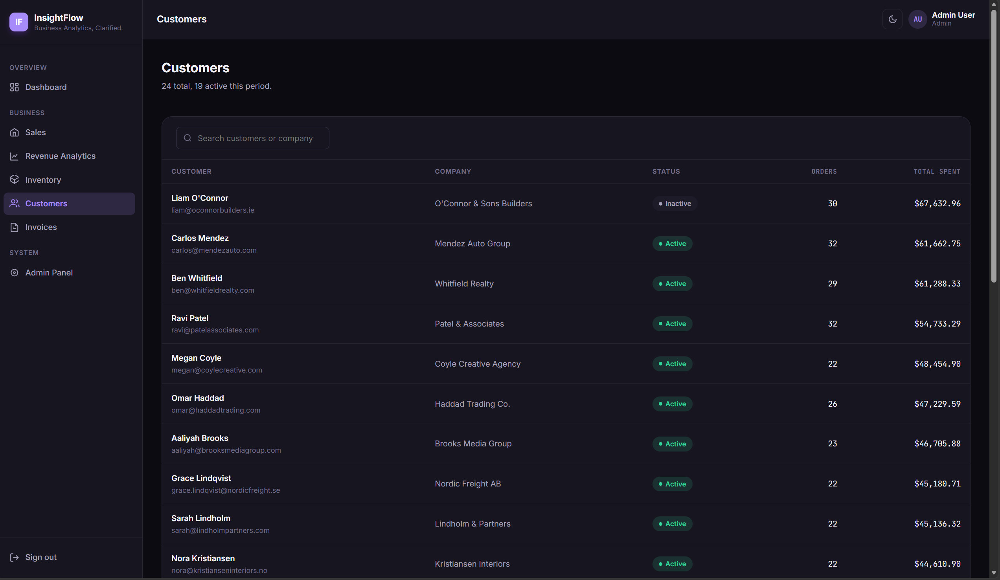

*Customer CRM with search, spending insights, and relationship overview.*

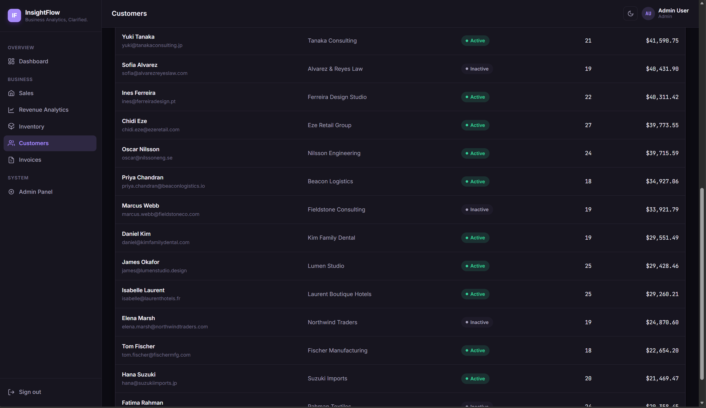

*Comprehensive customer profiles with company information, purchase history, and lifetime spending.*

---

### 🧾 Invoice Management

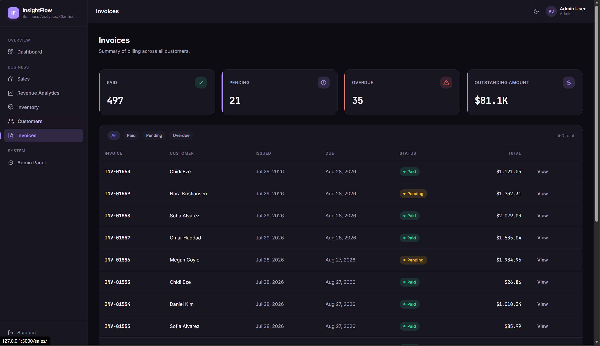

*Invoice dashboard summarizing paid, pending, and overdue invoices with outstanding balances.*

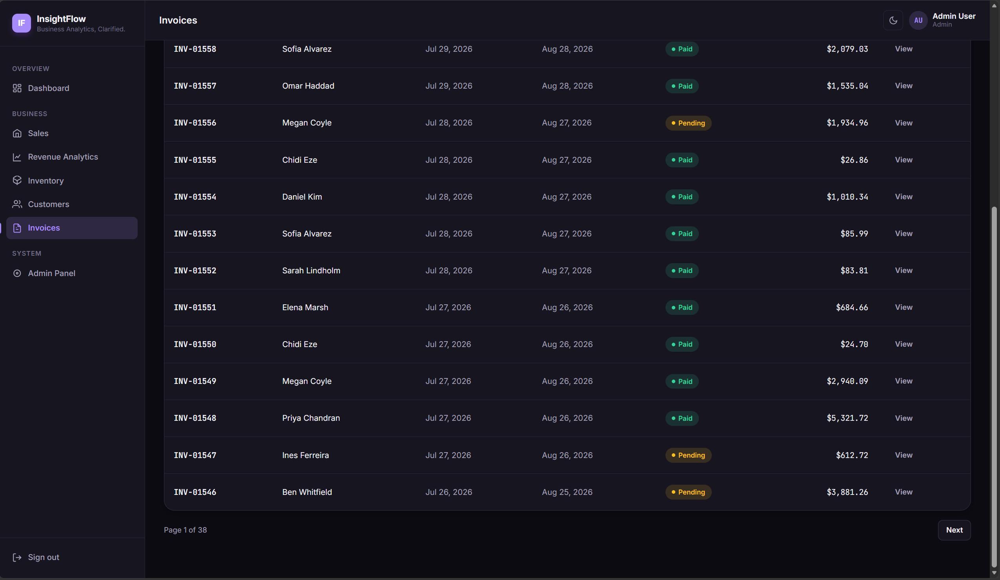

*Centralized invoice management with filtering, status tracking, and quick access to invoice records.*

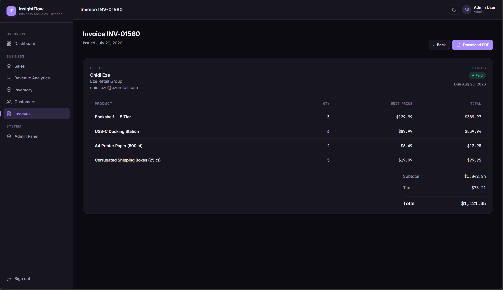

*Detailed invoice view with itemized products, customer information, and one-click PDF export.*

---

### ⚙️ Administration

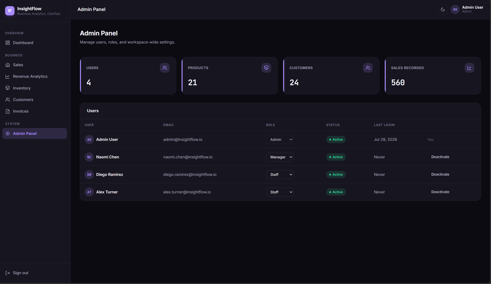

*Role-based administration panel for user management, permissions, account status, and workspace statistics.*

---

## 🧭 Notes on Extending This for a Client Project

- **Database**: swap SQLite for Postgres by changing `DATABASE_URL` in `.env` — no code changes needed since SQLAlchemy abstracts the dialect.
- **Payments**: `Sale.payment_method` is currently a free-text field seeded with common values; wire it to a real processor (Stripe, etc.) by adding a webhook endpoint under a new `payments` blueprint.
- **Multi-tenancy**: the schema is currently single-workspace. Add a `workspace_id` foreign key across models if you need to support multiple businesses on one deployment.
- **Deployment**: use gunicorn + a reverse proxy (nginx) in production; never run `run.py`'s dev server outside local development.

---

## 📄 License

This is a portfolio / demo project. Adapt freely for client work.
